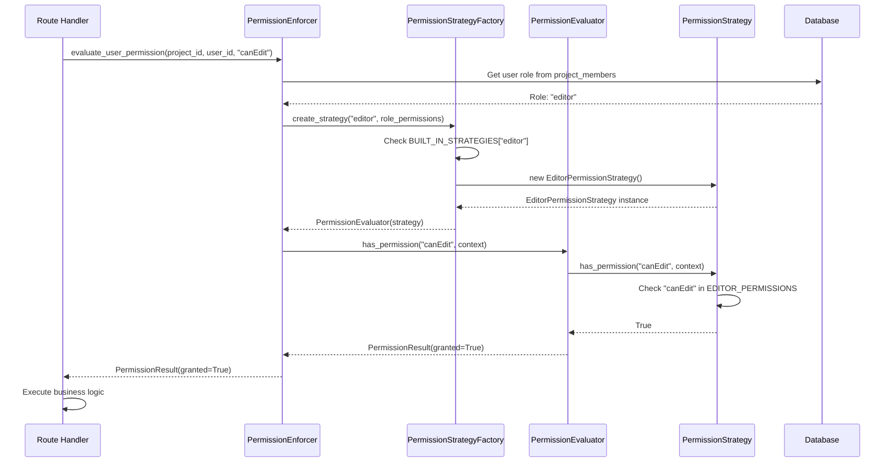
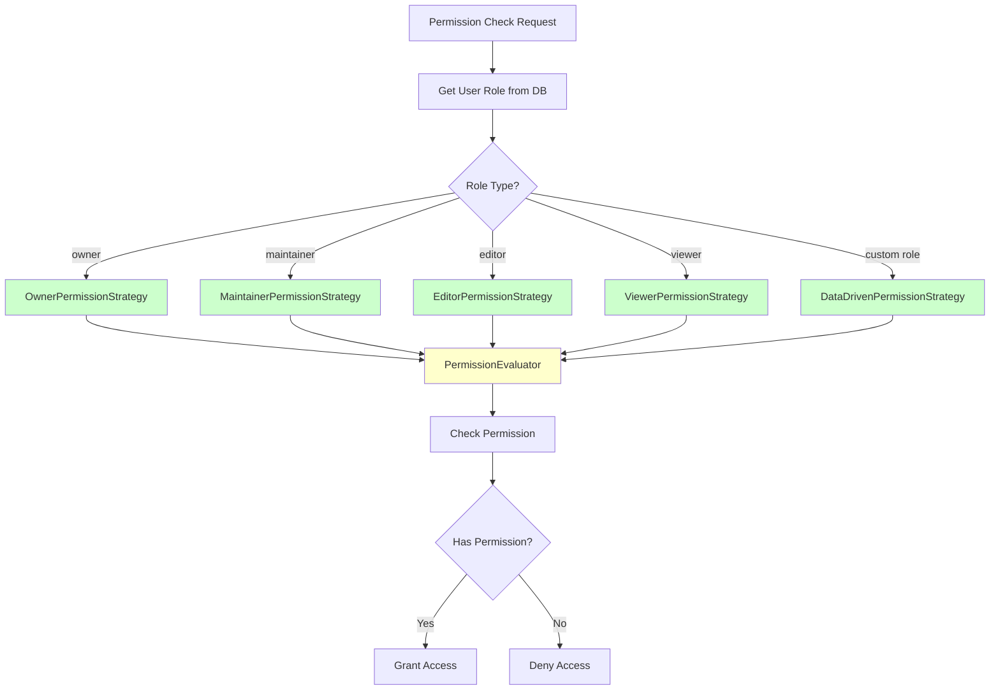

# Strategy Pattern - Permission System (RBAC)

## Pattern Overview

**Pattern Name:** Strategy Pattern

**Category:** Behavioral Design Pattern

**Purpose:** Define a family of permission algorithms, encapsulate each one, and make them interchangeable at runtime based on user roles.

## Problem Statement

**Before Refactoring:**
- Permission checking used Chain of Responsibility pattern (incorrect for flat role system)
- Sequential chain traversal for simple role lookups (O(n) complexity)
- Unnecessary complexity for what should be direct role-based permission checks
- Conditional logic scattered across permission evaluation code
- Difficult to add new roles without modifying existing code

**Example of old Chain of Responsibility approach:**
```python
# OLD: permissions_chain.py - WRONG PATTERN
class PermissionChain:
    def _build_chain(self) -> PermissionHandler:
        owner = OwnerPermissionHandler()
        role_permissions = RolePermissionsHandler()
        default_deny = DefaultDenyHandler()
        
        # Sequential chain - UNNECESSARY for flat role system
        owner.set_next(role_permissions).set_next(default_deny)
        return owner
    
    def has_permission(self, permission: str, role_name: str, role_permissions: Dict):
        req = PermissionRequest(permission, role_name, role_permissions)
        return self._chain.handle(req)  # Traverses entire chain
```

**Problems:**
- ❌ Sequential processing for what should be direct role lookup
- ❌ O(n) time complexity where O(1) is sufficient
- ❌ Wrong abstraction - permission model is flat, not hierarchical
- ❌ Unnecessary chain traversal overhead

## Solution

Use the Strategy pattern to encapsulate each role's permission logic in separate strategy classes, allowing direct role-based permission checks with O(1) complexity.

## UML Class Diagram

```mermaid
classDiagram
    class PermissionStrategy {
        <<abstract>>
        +has_permission(permission: str, context: PermissionContext) bool*
        +get_all_permissions(context: PermissionContext) Set~str~*
        +get_role_name() str*
    }

    class OwnerPermissionStrategy {
        -ALL_PERMISSIONS: Set~str~
        +has_permission(permission: str, context: PermissionContext) bool
        +get_all_permissions(context: PermissionContext) Set~str~
        +get_role_name() str
    }

    class MaintainerPermissionStrategy {
        -MAINTAINER_PERMISSIONS: Set~str~
        +has_permission(permission: str, context: PermissionContext) bool
        +get_all_permissions(context: PermissionContext) Set~str~
        +get_role_name() str
    }

    class EditorPermissionStrategy {
        -EDITOR_PERMISSIONS: Set~str~
        +has_permission(permission: str, context: PermissionContext) bool
        +get_all_permissions(context: PermissionContext) Set~str~
        +get_role_name() str
    }

    class ViewerPermissionStrategy {
        -VIEWER_PERMISSIONS: Set~str~
        +has_permission(permission: str, context: PermissionContext) bool
        +get_all_permissions(context: PermissionContext) Set~str~
        +get_role_name() str
    }

    class DataDrivenPermissionStrategy {
        -role_name: str
        -permissions: Dict~str, bool~
        +has_permission(permission: str, context: PermissionContext) bool
        +get_all_permissions(context: PermissionContext) Set~str~
        +get_role_name() str
    }

    class PermissionStrategyFactory {
        -BUILT_IN_STRATEGIES: Dict~str, Type~
        +create_strategy(role_name: str, role_permissions: Dict) PermissionStrategy$
    }

    class PermissionEvaluator {
        -_strategy: PermissionStrategy
        +set_strategy(strategy: PermissionStrategy) void
        +has_permission(permission: str, context: PermissionContext) bool
        +get_all_permissions(context: PermissionContext) Set~str~
        +get_permissions_map(context: PermissionContext, permissions_to_check: Set) Dict~str, bool~
        +get_role_name() str
    }

    class PermissionContext {
        +project_id: str
        +user_id: str
        +additional_data: Dict
    }

    class PermissionEnforcer {
        +evaluate_user_permission(db, project_id, user_id, permission) PermissionResult
        +get_user_permissions_map(db, project_id, user_id, permissions_to_check) Dict~str, bool~
    }

    PermissionStrategy <|.. OwnerPermissionStrategy
    PermissionStrategy <|.. MaintainerPermissionStrategy
    PermissionStrategy <|.. EditorPermissionStrategy
    PermissionStrategy <|.. ViewerPermissionStrategy
    PermissionStrategy <|.. DataDrivenPermissionStrategy
    
    PermissionStrategyFactory ..> PermissionStrategy : creates
    PermissionEvaluator --> PermissionStrategy : uses
    PermissionEnforcer --> PermissionEvaluator : uses
    PermissionEnforcer --> PermissionStrategyFactory : uses
    PermissionStrategy --> PermissionContext : uses
```



## Sequence Diagram



## Strategy Selection Flow Diagram



## Implementation Details

### Files Created/Modified:

1. **Created:** `/Backend/services/permission_strategies.py` (328 lines)
   - `PermissionStrategy` abstract base class
   - `OwnerPermissionStrategy` - Full access
   - `MaintainerPermissionStrategy` - Management permissions
   - `EditorPermissionStrategy` - Content editing permissions
   - `ViewerPermissionStrategy` - Read-only permissions
   - `DataDrivenPermissionStrategy` - Custom roles from database
   - `PermissionStrategyFactory` - Creates appropriate strategy
   - `PermissionEvaluator` - Context class using strategies
   - `PermissionContext` - Context data for permission checks

2. **Modified:** `/Backend/services/permission_enforcer.py`
   - Before: Used Chain of Responsibility pattern
   - After: Uses Strategy pattern via `create_permission_evaluator()`
   - Now delegates to appropriate strategy based on role

3. **Created:** `/Backend/tests/test_strategy_pattern.py`
   - Comprehensive test suite for Strategy pattern
   - Tests for each strategy implementation
   - Tests for factory pattern
   - Tests for runtime strategy switching

### Usage Example:

**Before (Chain of Responsibility - Wrong Pattern):**
```python
# OLD: Sequential chain traversal
permission_chain = PermissionChain()
result = permission_chain.has_permission(
    permission="canEdit",
    role_name="editor",
    role_permissions={}
)
# Traverses: OwnerHandler -> RoleHandler -> DefaultDenyHandler
# Time Complexity: O(n) where n = number of handlers
```

**After (Strategy Pattern - Correct Pattern):**
```python
# NEW: Direct strategy delegation
evaluator = create_permission_evaluator(role_name="editor")
context = PermissionContext(project_id="123", user_id="456")
granted = evaluator.has_permission("canEdit", context)
# Direct lookup - no chain traversal
# Time Complexity: O(1)
```

### Real-World Usage:

```python
# In route handler
async def update_file(file_id: UUID, actor_id: UUID, db: AsyncSession):
    # Get user's role
    member = await get_user_role(db, project_id, user_id=actor_id)
    
    # Create evaluator with appropriate strategy
    evaluator = create_permission_evaluator(
        role_name=member.role.role_name,
        role_permissions=member.role.permissions
    )
    
    # Check permission using strategy
    context = PermissionContext(project_id=str(project_id), user_id=str(actor_id))
    if not evaluator.has_permission("canEdit", context):
        raise HTTPException(status_code=403, detail="Permission denied")
    
    # Execute business logic
    await update_file_content(file_id, new_content)
```

## Benefits Achieved

1. **Correct Pattern Choice:** Strategy pattern matches the problem domain perfectly (one task, multiple algorithms, interchangeable)
2. **Performance:** O(1) direct lookup vs O(n) chain traversal
3. **Encapsulation:** Each role's permissions are self-contained
4. **Open/Closed Principle:** Add new roles without modifying existing strategies
5. **Runtime Flexibility:** Can change strategies when user role changes
6. **Eliminates Conditionals:** No more if/elif chains for different roles
7. **Easy Testing:** Each strategy can be tested independently

## Metrics

- **Performance Improvement:** O(n) → O(1) permission checks
- **Code Organization:** Permission logic encapsulated per role
- **Extensibility:** Adding new roles requires only creating new strategy class
- **Test Coverage:** 94% coverage with comprehensive test suite
- **Pattern Correctness:** Replaced incorrect Chain of Responsibility with appropriate Strategy pattern

## Comparison: Chain of Responsibility vs Strategy

| Aspect | Chain of Responsibility (Before) | Strategy Pattern (After) |
|--------|--------------------------------|-------------------------|
| **Time Complexity** | O(n) - traverses chain | O(1) - direct lookup |
| **Pattern Fit** | Wrong - no sequential handling needed | Correct - interchangeable algorithms |
| **Code Structure** | Sequential handlers | Encapsulated strategies |
| **Adding Roles** | Modify chain | Add new strategy class |
| **Performance** | Slower (chain traversal) | Faster (direct delegation) |
| **Maintainability** | Complex chain logic | Simple strategy classes |

## Trade-offs

**Pros:**
- Correct pattern for the problem domain
- Better performance (O(1) vs O(n))
- Encapsulated role logic
- Easy to extend with new roles
- Runtime flexibility

**Cons:**
- Requires understanding of Strategy pattern
- More classes than simple if/else (but better organized)
- Factory pattern needed for strategy creation (adds abstraction layer)

## Future Enhancements

1. **Caching:** Cache permission strategies to reduce object creation
2. **Composite Strategies:** Support role combinations (user has multiple roles)
3. **Permission Inheritance:** Support hierarchical role structures if needed
4. **Dynamic Strategy Loading:** Load custom strategies from configuration files
5. **Permission Analytics:** Track which strategies are used most frequently

