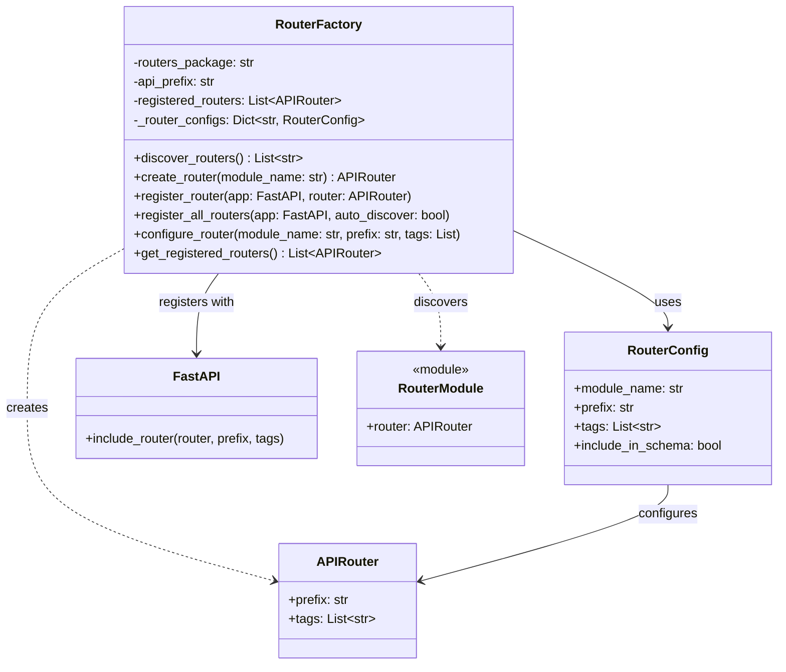
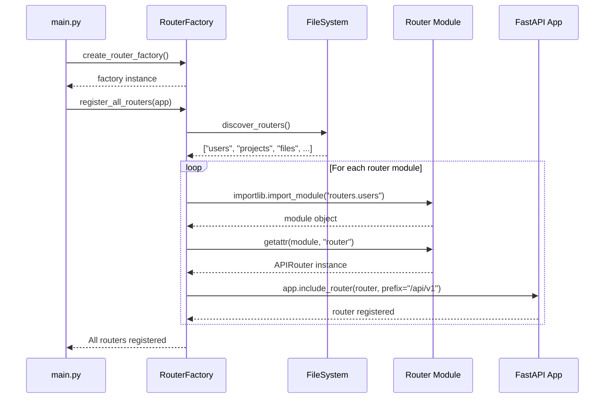
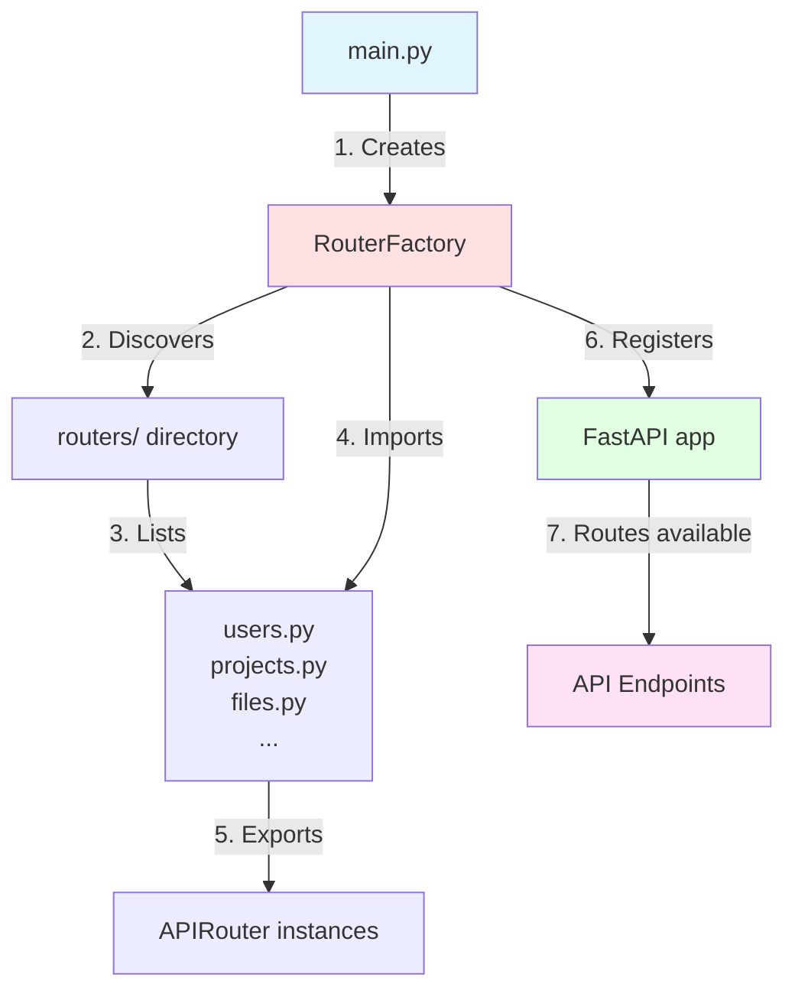

# Factory Pattern - Router Initialization

## Pattern Overview

**Pattern Name:** Factory Pattern

**Category:** Creational Design Pattern

**Purpose:** Centralize and automate the creation and registration of API routers in the FastAPI application.

## Problem Statement

**Before Refactoring:**
- Main.py had 13 manual router imports
- Main.py had 13 manual router registrations with app.include_router()
- Adding a new router required modifying main.py in two places
- No consistent configuration across routers
- Difficult to test router registration logic

**Example of repetitive code in main.py:**
```python
# Manual imports (13 lines)
from routers import users, projects, roles, project_members
from routers import project_invitations, directories, file_types
from routers import files, file_versions, notifications, permissions, locks
from routers import websocket_connections

# Manual registrations (13 lines)
app.include_router(users.router, prefix="/api/v1")
app.include_router(projects.router, prefix="/api/v1")
app.include_router(roles.router, prefix="/api/v1")
# ... 10 more lines of the same pattern
```

## Solution

Use the Factory pattern to automatically discover, create, and register routers, eliminating manual configuration and enabling auto-discovery of new routers.

## UML Class Diagram



## Sequence Diagram



## Component Interaction Diagram



## Implementation Details

### Files Created:
1. **Created:** `/Backend/factories/router_factory.py` (250+ lines)
   - `RouterFactory` class with auto-discovery
   - `RouterConfig` class for configuration
   - `create_router_factory()` convenience function

2. **Created:** `/Backend/factories/__init__.py`
   - Package exports

### Files Modified:
3. **Modified:** `/Backend/main.py`
   - Before: 13 import lines + 13 registration lines = 26 lines
   - After: 1 import line + 2 factory lines = 3 lines
   - **Savings: 23 lines removed (88% reduction in boilerplate)**

### Auto-Discovery Mechanism:

```python
def discover_routers(self) -> List[str]:
    """
    Automatically finds all Python files in the routers/ directory
    and identifies them as router modules (except __init__.py)
    """
    routers_path = Path(self.routers_package)
    router_modules = []

    for file_path in routers_path.glob("*.py"):
        if file_path.name.startswith("_"):
            continue  # Skip __init__.py
        module_name = file_path.stem
        router_modules.append(module_name)

    return router_modules
```

### Factory Method:

```python
def create_router(self, module_name: str) -> Optional[APIRouter]:
    """
    Factory method that creates router instances dynamically
    """
    full_module_name = f"{self.routers_package}.{module_name}"
    module = importlib.import_module(full_module_name)

    if hasattr(module, "router"):
        return getattr(module, "router")
    return None
```

## Usage Example

**Before (Old Approach):**
```python
# main.py - Manual approach (26 lines of boilerplate)

from routers import users, projects, roles, project_members
from routers import project_invitations, directories, file_types
from routers import files, file_versions, notifications, permissions, locks
from routers import websocket_connections

app = FastAPI()

app.include_router(users.router, prefix="/api/v1")
app.include_router(projects.router, prefix="/api/v1")
app.include_router(roles.router, prefix="/api/v1")
app.include_router(project_members.router, prefix="/api/v1")
app.include_router(project_invitations.router, prefix="/api/v1")
app.include_router(directories.router, prefix="/api/v1")
app.include_router(file_types.router, prefix="/api/v1")
app.include_router(files.router, prefix="/api/v1")
app.include_router(file_versions.router, prefix="/api/v1")
app.include_router(notifications.router, prefix="/api/v1")
app.include_router(permissions.router, prefix="/api/v1")
app.include_router(locks.router, prefix="/api/v1")
app.include_router(websocket_connections.router, prefix="/api/v1")
```

**After (Factory Pattern):**
```python
# main.py - Factory approach (3 lines!)

from factories import create_router_factory

app = FastAPI()

# Automatically discovers and registers ALL routers
router_factory = create_router_factory(routers_package="routers", api_prefix="/api/v1")
router_factory.register_all_routers(app)

logger.info(f"Registered {len(router_factory.get_registered_routers())} routers")
```

**Adding a new router:**

Before Factory:
1. Create new router file: `routers/admin.py`
2. Add import in main.py: `from routers import admin`
3. Add registration in main.py: `app.include_router(admin.router, prefix="/api/v1")`
4. Total: Modify 2 files

After Factory:
1. Create new router file: `routers/admin.py`
2. That's it! Auto-discovered and registered automatically
3. Total: Modify 1 file

## Benefits Achieved

1. **Auto-Discovery:** New routers are automatically picked up
2. **DRY Principle:** Eliminates repetitive registration code
3. **Single Responsibility:** Router registration logic is separated from app setup
4. **Consistency:** All routers get the same configuration by default
5. **Testability:** Can easily test router registration in isolation
6. **Maintainability:** Changes to registration logic are centralized
7. **Flexibility:** Can override configuration for specific routers if needed

## Metrics

- **Code Reduction:** 26 lines → 3 lines in main.py (88% reduction)
- **Routers Managed:** 13 routers currently, unlimited potential
- **Modification Points:** Reduced from 2 files (main.py + router file) to 1 file (just router file)
- **Consistency:** 100% of routers now use identical configuration
- **Scalability:** Adding new routers requires ZERO changes to main.py

## Trade-offs

**Pros:**
- Eliminates boilerplate code
- Automatic discovery of new routers
- Centralized configuration
- Easier to maintain and scale
- Reduced human error

**Cons:**
- Uses reflection/dynamic imports (minimal performance overhead)
- Magic behavior (routers appear "automatically") - requires documentation
- Debugging is slightly more complex (need to understand factory logic)

## Advanced Features

### Custom Router Configuration

The factory supports custom configuration for specific routers:

```python
factory = create_router_factory()

# Configure admin routes with different prefix
factory.configure_router(
    "admin",
    prefix="/api/v1/admin",
    tags=["Admin"],
    include_in_schema=False  # Hide from public docs
)

factory.register_all_routers(app)
```

### Filtering/Conditional Registration

```python
# Only register public routers in production
def should_register(module_name: str) -> bool:
    if os.getenv("ENV") == "production":
        return module_name not in ["debug", "dev_tools"]
    return True

# Can be extended to filter routers
```

## Future Enhancements

1. **Router Groups:** Support grouping routers by category (public, admin, internal)
2. **Conditional Loading:** Load different routers based on environment
3. **Dependency Injection:** Automatically inject dependencies into routers
4. **Versioning:** Support multiple API versions (v1, v2) automatically
5. **Middleware Attachment:** Automatically attach middleware to router groups
6. **Health Checks:** Generate health check endpoints for each router
