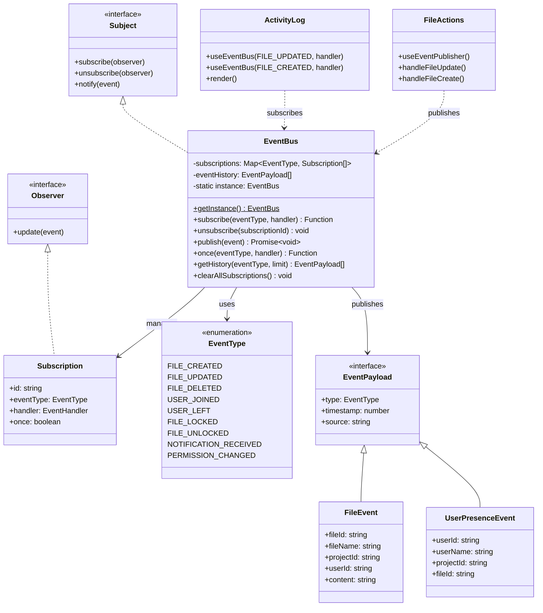
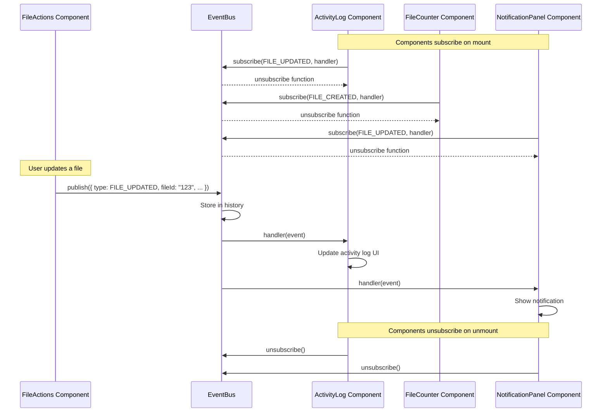
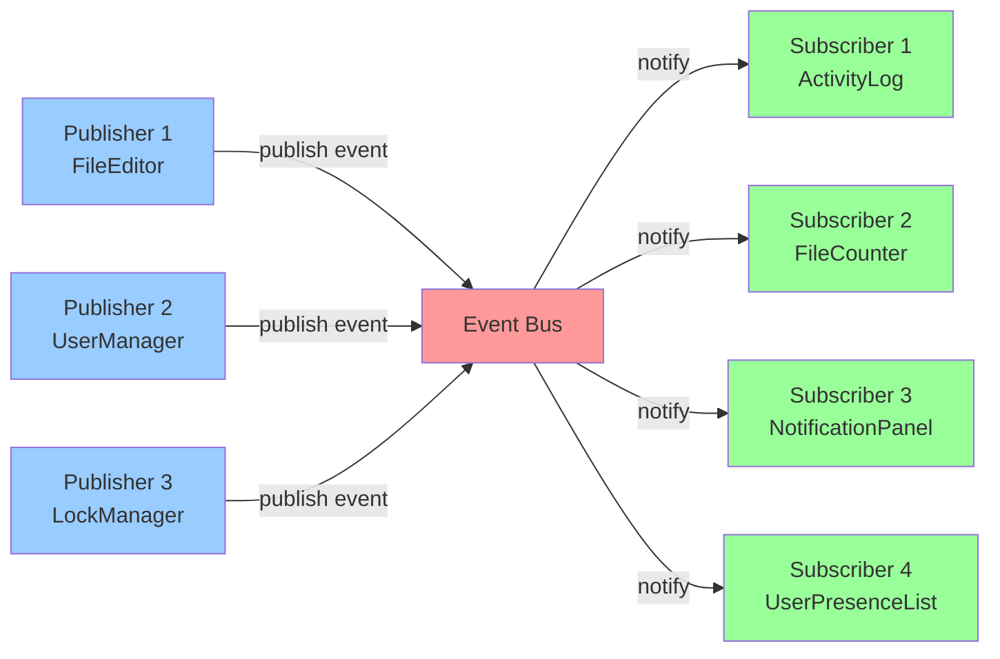

# Observer Pattern - Event Bus System

## Pattern Overview

**Pattern Name:** Observer Pattern (Publish-Subscribe)

**Category:** Behavioral Design Pattern

**Purpose:** Enable loose coupling between components by allowing them to communicate through events without direct dependencies.

## Problem Statement

**Before Refactoring:**
- Components needed direct references to notify other components of changes
- Parent components had complex prop drilling to pass callbacks down
- Adding new listeners required modifying existing components
- Tightly coupled components made testing difficult
- File changes, user presence, and notifications required manual coordination

**Example of tight coupling:**
```typescript
// Component A needs to notify Component B, C, D...
function FileEditor({ onFileUpdate, onUserJoin, onNotification }) {
  const handleSave = () => {
    // Tightly coupled - must know about all callbacks
    onFileUpdate(file);
    onUserJoin(user);
    onNotification(message);
  };
}

// Parent must wire everything together
function App() {
  return (
    <FileEditor
      onFileUpdate={handleFileUpdate}
      onUserJoin={handleUserJoin}
      onNotification={handleNotification}
    />
  );
}
```

## Solution

Implement an Event Bus using the Observer pattern, allowing components to publish and subscribe to events without knowing about each other.

## UML Class Diagram



## Sequence Diagram



## Pub/Sub Flow Diagram



## Implementation Details

### Files Created:

1. **Created:** `/Frontend/app/lib/events/EventBus.ts` (400+ lines)
   - `EventBus` class (Singleton)
   - `EventType` enum (16 event types)
   - Event payload interfaces
   - Subscription management
   - Event history tracking

2. **Created:** `/Frontend/app/lib/events/useEventBus.ts` (120 lines)
   - `useEventBus()` - React hook for subscribing
   - `useEventPublisher()` - Hook for publishing events
   - `useEventOnce()` - Subscribe to event once
   - `useEventHistory()` - Get event history

3. **Created:** `/Frontend/app/lib/events/index.ts`
   - Package exports

4. **Created:** `/Frontend/app/components/examples/EventBusExample.tsx` (300+ lines)
   - Complete working demo
   - Multiple components demonstrating loose coupling
   - Before/After comparison

### Key Features:

1. **Type-Safe Events:**
```typescript
export enum EventType {
  FILE_CREATED = "file:created",
  FILE_UPDATED = "file:updated",
  FILE_DELETED = "file:deleted",
  USER_JOINED = "user:joined",
  // ... 12 more event types
}
```

2. **Singleton Pattern:**
```typescript
export class EventBus {
  private static instance: EventBus | null = null;

  public static getInstance(): EventBus {
    if (!EventBus.instance) {
      EventBus.instance = new EventBus();
    }
    return EventBus.instance;
  }
}
```

3. **Event History:**
```typescript
private eventHistory: EventPayload[] = [];

public getHistory(eventType?: EventType, limit?: number): EventPayload[] {
  // Returns past events for debugging/replay
}
```

## Usage Examples

### Before (Tight Coupling):

```typescript
// FileEditor needs to know about ALL consumers
function FileEditor({
  onFileUpdate,
  onActivityLog,
  onNotification,
  onCounterIncrement
}: {
  onFileUpdate: (file: File) => void;
  onActivityLog: (message: string) => void;
  onNotification: (msg: string) => void;
  onCounterIncrement: () => void;
}) {
  const handleSave = () => {
    // Must manually call all callbacks
    onFileUpdate(file);
    onActivityLog(`File ${file.name} updated`);
    onNotification("File saved!");
    onCounterIncrement();
  };
}

// Parent must wire EVERYTHING together
function App() {
  return (
    <FileEditor
      onFileUpdate={handleFileUpdate}
      onActivityLog={handleActivityLog}
      onNotification={handleNotification}
      onCounterIncrement={handleCounterIncrement}
    />
  );
}
```

**Problems:**
- FileEditor knows about 4+ different consumers
- Adding a new consumer requires modifying FileEditor
- Props drilling nightmare
- Difficult to test in isolation

### After (Observer Pattern):

```typescript
// Publisher - doesn't know about consumers!
function FileEditor() {
  const publish = useEventPublisher();

  const handleSave = () => {
    // Just publish the event - don't care who's listening!
    publish({
      type: EventType.FILE_UPDATED,
      fileId: file.id,
      fileName: file.name,
      projectId: currentProject,
      timestamp: Date.now()
    });
  };

  return <button onClick={handleSave}>Save</button>;
}

// Subscriber 1 - Independent
function ActivityLog() {
  useEventBus(EventType.FILE_UPDATED, (event) => {
    addToLog(`File ${event.fileName} updated`);
  });

  return <div>{/* Render activity log */}</div>;
}

// Subscriber 2 - Independent
function NotificationPanel() {
  useEventBus(EventType.FILE_UPDATED, (event) => {
    showNotification("File saved!");
  });

  return <div>{/* Render notifications */}</div>;
}

// Subscriber 3 - Independent
function FileCounter() {
  const [count, setCount] = useState(0);

  useEventBus(EventType.FILE_CREATED, () => {
    setCount(c => c + 1);
  });

  return <div>Files: {count}</div>;
}

// Parent is CLEAN - no prop drilling!
function App() {
  return (
    <>
      <FileEditor />
      <ActivityLog />
      <NotificationPanel />
      <FileCounter />
    </>
  );
}
```

**Benefits:**
- FileEditor doesn't know about ANY consumers
- Can add new subscribers without modifying publisher
- No props drilling
- Components can be tested in complete isolation
- Easy to add/remove features

## Real-World Use Cases in the Project

### 1. File Change Notifications
```typescript
// When file is updated in editor
publish({
  type: EventType.FILE_UPDATED,
  fileId: file.id,
  fileName: file.name,
  content: newContent
});

// Multiple subscribers can react:
// - Activity log records the change
// - File tree updates the modified timestamp
// - Notification shows "File saved"
// - Collaboration system syncs with other users
```

### 2. User Presence Tracking
```typescript
// When user joins a project
publish({
  type: EventType.USER_JOINED,
  userId: user.id,
  userName: user.name,
  projectId: currentProject
});

// Subscribers:
// - User list updates to show new user
// - Welcome notification appears
// - Activity log shows "User X joined"
// - Analytics track active users
```

### 3. Lock Management
```typescript
// When file is locked
publish({
  type: EventType.FILE_LOCKED,
  fileId: file.id,
  userId: currentUser.id
});

// Subscribers:
// - File tree shows lock icon
// - Editor becomes read-only for other users
// - Lock panel updates
// - Notification shows who has the lock
```

## Benefits Achieved

1. **Loose Coupling:** Publishers don't know about subscribers
2. **Scalability:** Easy to add new subscribers without modifying publishers
3. **Maintainability:** Event logic centralized in EventBus
4. **Testability:** Components can be tested in isolation
5. **Flexibility:** Subscribers can be added/removed dynamically
6. **Reusability:** Same event can trigger multiple independent actions
7. **Debugging:** Event history provides audit trail

## Metrics

- **Event Types Defined:** 16 event types covering files, users, locks, notifications
- **Components Decoupled:** Publisher components don't reference subscriber components
- **Prop Drilling Eliminated:** No need to pass callbacks through component hierarchy
- **Subscribers Per Event:** Unlimited (1-to-many relationship)
- **Code Reduction:** Eliminates callback prop chains, estimated 30-50 lines saved per feature

## Trade-offs

**Pros:**
- Complete decoupling of components
- Easy to add new features without modifying existing code
- Clean component interfaces
- Event history for debugging
- Type-safe with TypeScript

**Cons:**
- Events are "invisible" - harder to trace flow in IDE
- Debugging requires understanding event flow
- Potential for memory leaks if subscriptions not cleaned up (mitigated by React hooks)
- Event history consumes memory (capped at 100 events)

## Advanced Features

### 1. One-Time Subscriptions
```typescript
// Subscribe only once
eventBus.once(EventType.USER_JOINED, (event) => {
  showWelcomeMessage(event.userName);
});
```

### 2. Wildcard Subscriptions
```typescript
// Subscribe to ALL events
eventBus.subscribe("*", (event) => {
  console.log("Event occurred:", event.type);
});
```

### 3. Event History Replay
```typescript
// Get recent file update events
const recentUpdates = eventBus.getHistory(EventType.FILE_UPDATED, 10);

// Replay events (useful for debugging)
recentUpdates.forEach(event => {
  console.log(`${event.fileName} updated at ${new Date(event.timestamp)}`);
});
```

### 4. Automatic Cleanup with React Hooks
```typescript
// Hook automatically unsubscribes on component unmount
function MyComponent() {
  useEventBus(EventType.FILE_UPDATED, (event) => {
    // This is automatically cleaned up!
  });

  return <div>Component</div>;
}
```

## Future Enhancements

1. **Event Filtering:** Subscribe to events matching a pattern
2. **Priority Handling:** Execute high-priority handlers first
3. **Event Batching:** Batch multiple events for performance
4. **Async Events:** Support for async event handlers with error handling
5. **Event Persistence:** Save event history to localStorage for recovery
6. **Event Replay:** Replay events for debugging or state reconstruction
7. **Performance Monitoring:** Track event processing times
8. **Event Validation:** Validate event payloads against schemas
