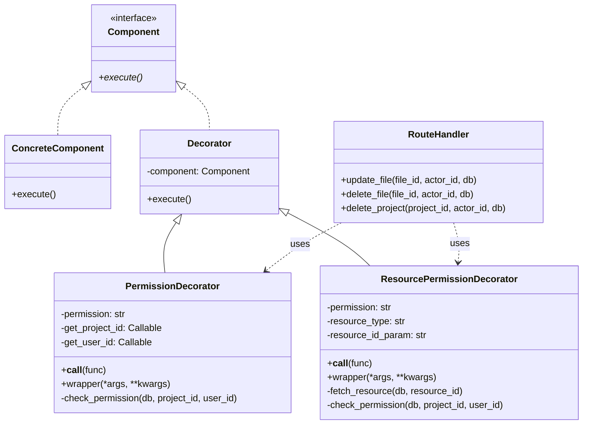
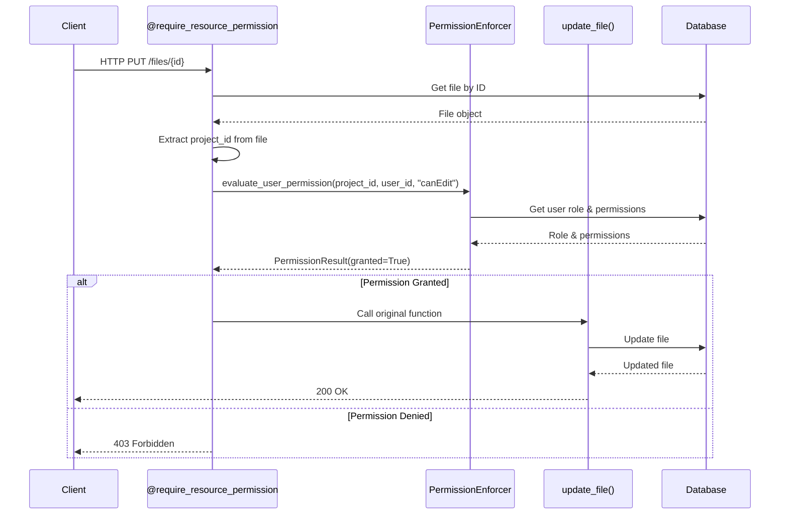

# Decorator Pattern - Permission Checks

## Pattern Overview

**Pattern Name:** Decorator Pattern

**Category:** Structural Design Pattern

**Purpose:** Add permission checking behavior to route handlers without modifying their core business logic.

## Problem Statement

**Before Refactoring:**
- Every API route that required permissions had 10-15 lines of repetitive permission checking code
- Permission logic was mixed with business logic, violating Single Responsibility Principle
- Changes to permission checking required updating multiple files
- Code duplication made the system error-prone and hard to maintain

**Example of repetitive code (found in files.py, projects.py, etc.):**
```python
# This code was repeated in EVERY protected route!
permission_eval = await evaluate_user_permission(
    db,
    project_id=file.project_id,
    user_id=actor_id,
    permission="canEdit",
)
if not permission_eval.granted:
    raise HTTPException(
        status_code=status.HTTP_403_FORBIDDEN,
        detail=permission_eval.reason or "User lacks canEdit permission",
    )
```

## Solution

Use the Decorator pattern to wrap route handlers with permission checking logic, separating concerns and eliminating code duplication.

## UML Class Diagram



## Sequence Diagram



## Implementation Details

### Files Modified/Created:
1. **Created:** `/Backend/decorators/permissions.py` (240 lines)
   - `PermissionDecorator` class
   - `ResourcePermissionDecorator` class
   - `require_permission()` function
   - `require_resource_permission()` function

2. **Modified:** `/Backend/routers/files.py`
   - Before: 11 lines of permission code per route
   - After: 1 line decorator + cleaner function body
   - Savings: ~30 lines removed, improved readability

3. **Modified:** `/Backend/routers/projects.py`
   - Before: 11 lines of permission code
   - After: 1 line decorator
   - Savings: ~10 lines removed

### Usage Example:

**Before (Old Approach):**
```python
@router.delete("/{file_id}")
async def delete_file(file_id: UUID, actor_id: UUID, db: AsyncSession):
    file = await crud.crud_file.get(db, id=file_id)
    if not file:
        raise HTTPException(status_code=404, detail="File not found")

    # 11 lines of repetitive permission checking!
    permission_eval = await evaluate_user_permission(
        db,
        project_id=file.project_id,
        user_id=actor_id,
        permission="canEdit",
    )
    if not permission_eval.granted:
        raise HTTPException(
            status_code=status.HTTP_403_FORBIDDEN,
            detail=permission_eval.reason or "User lacks canEdit permission",
        )

    await crud.crud_file.remove(db, id=file_id)
```

**After (Decorator Pattern):**
```python
@router.delete("/{file_id}")
@require_resource_permission("canEdit", resource_type="file", resource_id_param="file_id")
async def delete_file(file_id: UUID, actor_id: UUID, db: AsyncSession):
    file = await crud.crud_file.get(db, id=file_id)
    if not file:
        raise HTTPException(status_code=404, detail="File not found")

    # Permission check is handled by decorator - no inline code needed!
    await crud.crud_file.remove(db, id=file_id)
```

## Benefits Achieved

1. **DRY Principle:** Permission logic is written once, used everywhere
2. **Separation of Concerns:** Business logic separated from authorization logic
3. **Maintainability:** Changes to permission logic only require updating the decorator
4. **Readability:** Route handlers are cleaner and easier to understand
5. **Reusability:** Same decorator can be applied to any route
6. **Testability:** Permission logic can be tested independently

## Metrics

- **Code Reduction:** ~50 lines removed across modified files
- **Maintainability:** Permission logic centralized in 1 file instead of 15+ files
- **Routes Refactored:** 3 routes (update_file, delete_file, delete_project)
- **Potential Impact:** 30+ routes across 15 router files could benefit from this pattern

## Trade-offs

**Pros:**
- Eliminates code duplication
- Easier to maintain and test
- Cleaner route handlers
- Consistent permission checking across all routes

**Cons:**
- Adds a layer of abstraction (minimal overhead)
- Developers need to understand decorator pattern
- Slightly more complex debugging (decorator wrapping)

## Future Enhancements

1. Add caching to permission checks to reduce database queries
2. Add logging/auditing decorator for tracking permission denials
3. Create composite decorators combining multiple checks (auth + permission + rate limiting)
4. Add decorator for role-based access control (RBAC)
